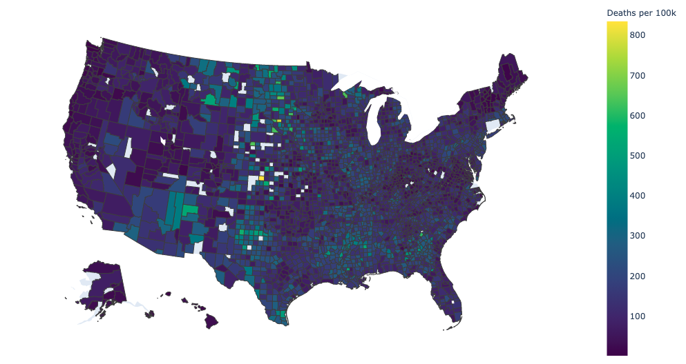
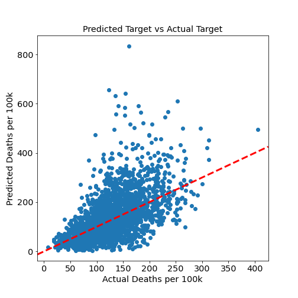

# Predicting US County Covid-19 Deaths with US Census Data

### Objective:
---

Predict US county Covid-19 deaths scaled by population using US census data in order to identify those counties which are more at risk than others. By identifying these counties, resources can be deployed more efficiently. The figure below shows the number of Covid-19 deaths scaled per 100k persons for counties in the US.

This project was developed over two weeks as part of the [Metis](https://www.thisismetis.com/) data science boot-camp in January 2021. 

### Methodology and Results:
---

US county-level census and Covid-19 data were scraped from the US Census Bureau and downloaded from the New York Times Covid-19 GitHub repository respectively. The target prediction variable selected was cumulative Covid-19 deaths, scaled per 100k persons. (Originally, weekly Covid-19 data was scraped via Selenium from the CDC, however the predictive model was ineffective at that granularity.) The target variable was scaled by population in order to avoid simply identifying those counties which simply had the most people, and by extension, deaths. 

A simple linear regression model was tested along with LASSO and Ridge regressions, all of which were tested with and without polynomial features. The final selected input features are listed below. All models were tested with cross-validation in order to verify model stability to reduce under- or over-fitting. Ultimately the best performing model, LASSO with polynomial features, was chosen as the final model due to it's greatest performance. It had an R2 of 36% on the training data and 32% on the test data, with a mean absolute error and root-mean-square error of 182.1 and 205.5 deaths per 100k respectively. A plot of the predicted deaths vs the actual deaths per county can be found below. While the unexplained variance and errors are large, this is unsurprising considering the complexity of the problem. Ultimately the model would have to be improved significantly for it to be of any real use. A presentation detailing the results of the project including various plots can be found [here](Presentation/CovidProjectPresentation.pdf). 

Features (most recent county-level census data): 

- Persons 65 years and over, percent
- Black or African American alone, percent
- Two or More Races, percent
- White alone, not Hispanic or Latino, percent
- Median value of owner-occupied housing units
- Living in same house 1 year ago, percent of persons age 1 year+
- Households with a computer, percent
- Households with a broadband Internet subscription, percent
- High school graduate or higher, percent of persons age 25 years+
- Bachelor's degree or higher, percent of persons age 25 years+
- Persons without health insurance, under age 65 years
- Median household income

### Data:
---

- US county-level census data scraped from the Census Bureau [QuickFacts](https://www.census.gov/quickfacts/fact/table/) page
- Covid-19 county-level data dated 01/18/2021 from the New York Times GitHub [repository](https://github.com/nytimes/covid-19-data)
- Covid-19 county-level data scraped from the CDC [data tracker](https://covid.cdc.gov/covid-data-tracker/#county-view) (this was ultimately not used in the project)

### Tools and techniques:
---

- BeautifulSoup and Selenium for web scraping
- Feature engineering, standardization, polynomial, and Box-Cox transform
- Linear regression
- Regularization via LASSO and Ridge regression
- Cross validation
- Matplotlib, Seaborn, Plotly for visualization

### File details:
---

- `code/`

	- `doRegression.ipynb` - main code which reads in the county data, selects the primary features, and performs various regression fits on the data
	- `regressionUtils.py` - file containing methods for various linear regression models used to fit the data
	- `plotUtils.py` - a few plotting methods for model evaluation and comparison
	- `doEDA-totals.ipynb` - notebook for initial exploratory data analysis and code setup
	- `pullCensusData.ipynb` - code for scraping census data
	- `combineDataFramesNYT.ipynb` - code to combine census and Covid-19 data into a single saved dataframe
	- `attic/pullCovidDataScript.py` - script for scraping Covid-19 data from the CDC via Selenium, ultimately not used in the final version of the project

- `Data/`

	- `county_census_info.pkl` - saved county-level census data
	- `NYT-Covid/us-counties-totals.csv` - county-level Covid-19 data containing cumulative totals
	- `county_data_totals.pkl` - combined census and Covid-19 data in one dataframe
	- `CDC-COVID/Alabama.pkl, etc.` - county-level Covid-19 data saved per state, scraped from the CDC and ultimately not used in the final version of the project

Note that there are a few other files, both code and data, which are not detailed here as they are less important.

